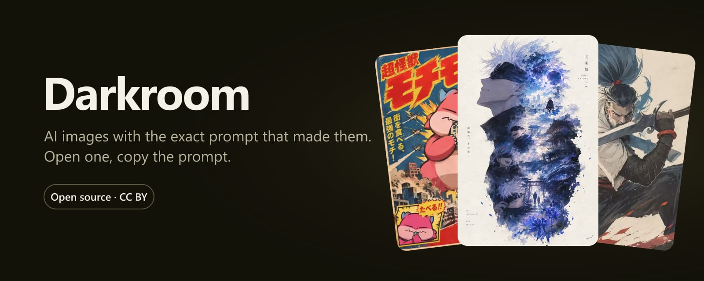
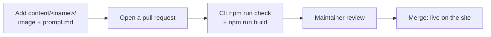

<p align="center">
  <a href="https://darkroom-black-xi.vercel.app"></a>
</p>

<p align="center">
  <a href="https://darkroom-black-xi.vercel.app"><b>Open the gallery</b></a> ·
  <a href="CONTRIBUTING.md"><b>Add your prompt</b></a> ·
  <a href="https://github.com/Tizun71/Darkroom/issues/new/choose">Submit without git</a>
</p>

<p align="center">
  <a href="https://github.com/Tizun71/Darkroom/actions/workflows/check.yml"></a>
  <a href="LICENSE"></a>
  <a href="content/LICENSE"></a>
  <a href="https://github.com/Tizun71/Darkroom/pulls"></a>
</p>

# Darkroom

A static gallery of AI images, each shown with the prompt that made it. Open an image, press Copy, paste the prompt into Midjourney, FLUX, GPT Image or any other tool.

Built with Vite, React and Tailwind. No backend, no accounts, no tracking.

## Run

```bash
npm install
npm run dev       # http://localhost:5173
npm run build     # outputs dist/, deploy to any static host
npm run preview   # preview the build
npm run check     # validate content/ (CI runs this on every PR)
```

## How others contribute



See `/contribute.html` or `CONTRIBUTING.md` for the full guide. People who do not use pull requests can use the "Submit a prompt" issue form.

Links to the repository (upload, fork, issue) come from `REPO_URL` in `src/config.ts`. Change it if you fork to another repository.

## Add an image

Each work is **one folder** in `content/`:

```
content/
  harbor-dawn/
    image.avif    ← image (image.jpg .jpeg .png .webp .avif .gif)
    prompt.md     ← prompt
```

The fastest way:

```bash
npm run add -- ~/Downloads/poster.png harbor-dawn
```

This compresses the image to `content/harbor-dawn/image.avif` and creates a template `prompt.md`. Fill in the fields, paste the prompt, and run `npm run check`.

`prompt.md` looks like this:

```md
---
title: Harbor at dawn
model: Midjourney v7
date: 2026-09-25
tags: landscape, morning
negative: text, watermark
---
Fishing boats in a quiet harbor at dawn, mist on the water, ...
```

- Everything below the second `---` is the prompt. The copy button copies exactly this text.
- `title`, `model`, `date` and `tags` are required (`npm run check` fails without them). `negative` and `author` are optional. The work with the newest `date` shows first.
- The image must be a file in the work's folder. `npm run check` rejects `image: https://...` so images cannot disappear later.
- Limits: image ≤ 400 KB, long edge 512–2048 px (`npm run check` enforces them). `npm run add` outputs AVIF at 1440 px, quality 45, usually 70–120 KB.
- Image too large: `npm run add -- <image> <name>` shrinks it and saves it as `content/<name>/image.avif` (`npm run compress` is an alias).
- The folder name (`harbor-dawn`) is the share link: `/#/harbor-dawn`.
- `author:` takes an X profile link (`https://x.com/name`), a GitHub profile link or a GitHub username. X avatars come from `https://unavatar.io/x/name`, GitHub avatars from `https://unavatar.io/github/name`.

While `npm run dev` runs, the page reloads whenever you add, edit or delete a file in `content/`. If a folder has no `prompt.md` or no image, the terminal shows an error and that work is skipped.

## Images through a CDN (jsDelivr)

When Vercel builds from a GitHub commit, images are **not** bundled into `dist/`. The site points straight at jsDelivr, pinned to the deployed commit:

```
https://cdn.jsdelivr.net/gh/<owner>/<repo>@<commit-sha>/content/<name>/image.avif
```

- Turns on automatically through Vercel system env vars (`VERCEL_GIT_REPO_OWNER`, `VERCEL_GIT_REPO_SLUG`, `VERCEL_GIT_COMMIT_SHA`). "Automatically expose System Environment Variables" must be on (default) and the repository must be public.
- Pinned by SHA, so URLs never go stale and jsDelivr caches them forever. Image sizes are still read at build time, so the grid does not jump.
- `IMAGE_CDN=off`: turn it off and bundle images as usual (for `vercel deploy` from a machine with unpushed commits).
- `IMAGE_CDN_BASE=https://cdn.jsdelivr.net/gh/Tizun71/Darkroom@main`: set the base URL by hand when building elsewhere.
- Local runs (`npm run dev`, `npm run build`) have none of these env vars, so they use local images.

### Keep the repository small

- Every committed file stays in git history forever. Always compress images (`npm run add`) before committing. Never commit the original PNG.
- On GitHub: Settings → General → Pull Requests, enable only **Allow squash merging**. A PR that pushed an original image and then fixed it leaves no heavy file in `main` history.
- jsDelivr does not serve repositories over 150 MB or files over 20 MB. At ~100 KB per image, git + jsDelivr is enough for about 1000 images. When the repository nears 100 MB, move images to Cloudflare R2 (10 GB free, no bandwidth fees) and set `image: https://...` in `prompt.md`.
- Do not use Git LFS: jsDelivr serves only the pointer file, not the image.

## Structure

The site does one thing: look at images, press Copy. A one-line header, a sticky search bar with tags, the image grid. Click an image to see the full prompt and copy it.

| Path | Role |
|---|---|
| `content/` | One folder per work: `image.*` + `prompt.md`. Usually the only place to edit. |
| `plugins/content.ts` | Reads `content/`: parses frontmatter, `author:` and image size. Shared by the plugin and the scripts. |
| `plugins/gallery.ts` | Vite plugin that builds the `virtual:gallery` module and picks local or CDN images. |
| `scripts/add-entry.ts` | `npm run add`: compresses the image, creates the folder and a template `prompt.md`. |
| `scripts/check-content.ts` | `npm run check`: validates folder names, required fields and image size. |
| `src/main.tsx`, `src/App.tsx` | Gallery page: header, filter bar, grid, lightbox. |
| `src/page.tsx` | Entry for the static pages. Each HTML file picks its page with `<body data-page="...">`. |
| `src/pages/` | `Contribute`, `Legal` (Privacy, Terms), `NotFound`. |
| `src/hooks/` | `useGalleryFilter` (search, tag filter), `useShareLink` (share link `#/<id>`). |
| `src/components/` | `Wall` (masonry grid), `Lightbox` (details, Copy button), `FilterBar`, `SiteHeader`, `SiteFooter`, `EmptyState`, `CopyButton`, `Author`... |
| `src/config.ts` | `REPO_URL`: GitHub link in the header and on the contribute page. |
| `src/index.css` | Colors and fonts (Tailwind v4 `@theme`). |
| `docs/` | Images for this README. |
| `.github/` | CI, PR template, issue form. |

## License

- Code: [MIT](LICENSE).
- Images and prompts in `content/`: [CC BY 4.0](content/LICENSE). Copyright belongs to the contributor named in `author:`. Credit them when you reuse a work.
